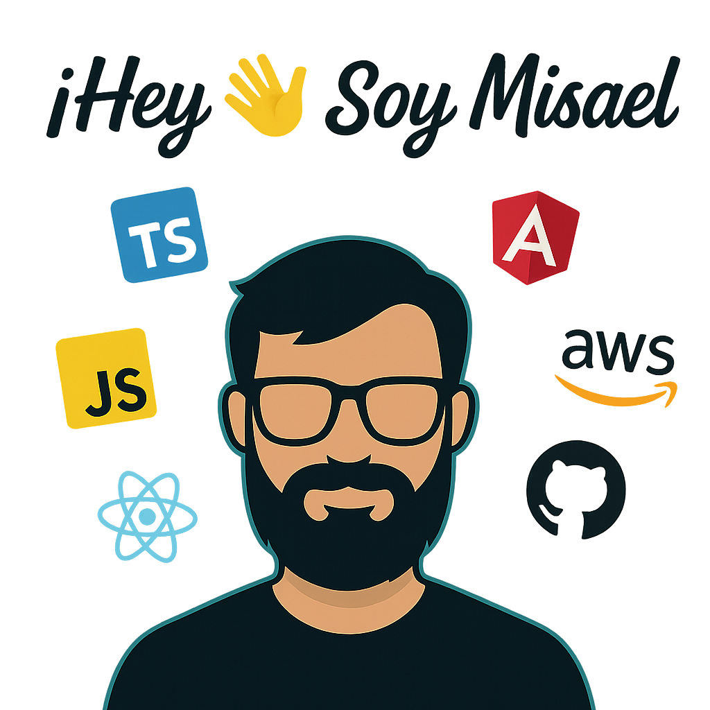

  

Soy **Technical Leader** y **Frontend Developer Senior** con más de 8 años creando experiencias digitales de alto impacto. Me apasiona construir soluciones robustas, escalables y seguras utilizando **Angular**, **Ionic**, **React** y **arquitecturas limpias**.

Actualmente lidero el desarrollo frontend de productos digitales en **Seguros Bolívar**, incluyendo la app **Bolívar Conmigo**.

---

## 🚀 Últimos proyectos

### 🔷 Bolívar Conmigo App
Aplicación híbrida (Angular + Ionic) orientada al bienestar, salud y movilidad de los usuarios.  
**Stack:** Angular · Ionic · React · Clean Architecture

---

## 🧠 Tecnologías favoritas

  
  
  
  
  
  
  
  
  
  
  
  
  
  
  
  

---

## 🧱 Skills & Enfoques

- 🔹 Frontend moderno (Angular, Ionic, TypeScript)
- 🔹 Arquitectura limpia y hexagonal
- 🔹 CI/CD con GitHub Actions
- 🔹 Seguridad en el desarrollo desde el diseño
- 🔹 Liderazgo técnico de equipos frontend

---

## 📬 Conecta conmigo

  
  

---

> _"Construir buen software es más que codificar, es diseñar soluciones que importen."_  
> — Misael Torres
